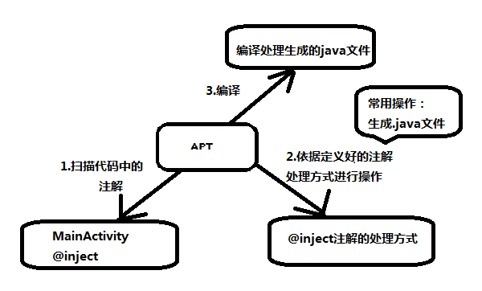

##APT (Android annotation process tool)
####一 APT的介绍
是一种处理注释的工具，它对源代码文件进行检测找出其中的Annotation，使用Annotation进行额外的处理。
Annotation处理器在处理Annotation时可以根据源文件中的Annotation生成额外的源文件和其它的文件（文件具体内容由Annotation处理器的编写者决定），APT还会编译生成源文件和原来的源文件，将它们一起生成class文件。简言之：APT可以把注解，在编译时生成代码。

####二 APT的处理要素
注解处理器（AbstractProcess）+代码处理（javaPoet）+处理器注册（AutoService）+apt
####三，使用APT来处理annotation的流程
　　1.定义注解（如@automain）
　　2.定义注解处理器
　　3.在处理器里面完成处理方式，通常是生成java代码。
　　4.注册处理器
　　5.利用APT完成如下图的工作内容。

