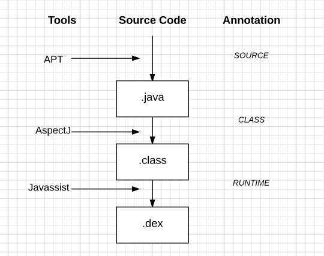

#### APT：Android annotation process tool 把注解，在编译时生成代码通过创建一个Processor(继承于AbstractProcessor) 来在编译的时候来处理注解的， 然后再配合上[JavaPoet](https://github.com/square/javapoet)  来生成自己想要的代码。
####AspectJ:是一套支持AOP的语言，完全兼容java语言
####Javassist: 是一个执行字节码操作的强而有力的驱动代码库。它允许开发者自由的在一个已经编译好的类中添加新的方法，或者是修改已有的方法。

