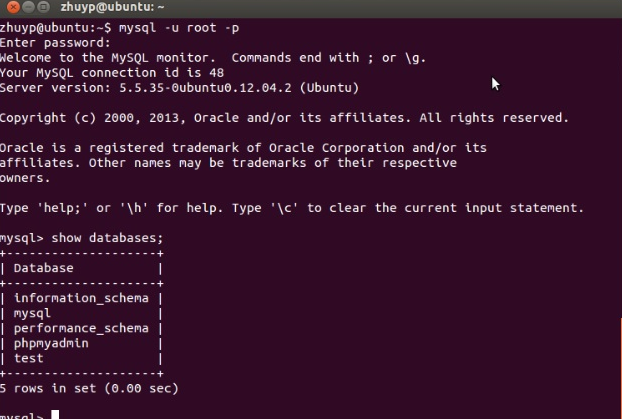
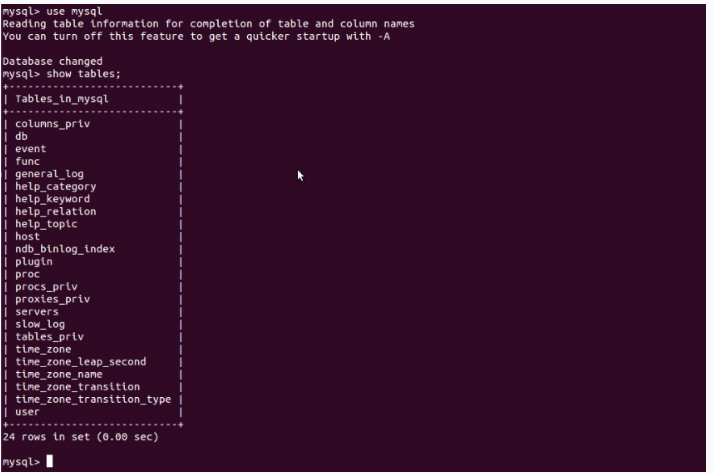

登陆mysql数据库可以通过如下命令：
```
mysql -u root -p
```
-u 表示选择登陆的用户名， -p 表示登陆的用户密码，上面命令输入之后会提示输入密码，此时输入密码就可以登录到mysql。
然后通过 
```
show databases; 
```
就可以查看当前的数据库。


我们选择 mysql数据库就行下一步操作，使用
```
use mysql 
```
命令，显示当前数据库的表单：
```
show tables;
```



###创建数据库
```
mysql> create database zheng;
```