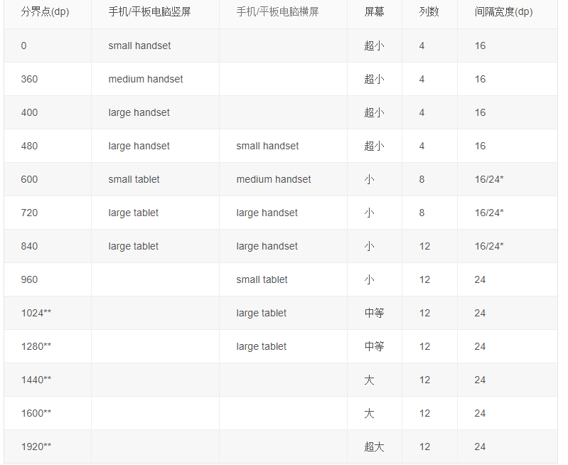

Media queries are a key component of responsive design, which make it possible for CSS to adapt based on various parameters or device characteristics.For example, a media query can apply different styles if the screen is smaller than a certain size, or based on whether the user is holding their device in portrait or landscape mode.

媒体查询是响应式设计的关键部分，它让CSS适配不同变量和设备特性成为可能。

BreakPoint ： 分界点，阀值
这里的BreakPoint指浏览器显示的一个尺寸分界点，类似 720x1080对应xdpi, BreakPoint就是一个区分设备尺寸的分界点

