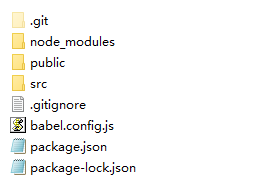
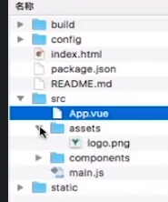
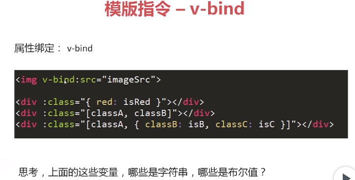

##  Vue简介和文件组成
[旧版视频教程](https://www.imooc.com/video/12299)
#### 下图是一个vue实现的输入显示的demo


#### .Vue文件的组成


## Vuejs 开发环境搭建和热更新

#### NPM
node pakege manage
大家都用的管理工具 这个不用解析了
因为有墙，国内用[淘宝的镜像](http://npm.taobao.org/)比较快

```
$ npm install -g cnpm --registry=https://registry.npm.taobao.org
```

#### Vue-CLI
Vue官方提供的[命令行工具](https://github.com/vuejs/vue-cli/)

Quick start
```
# 安装管理工具
npm install -g @vue/cli  

#  用工具生成一个项目
vue create my-project    
```

如果装了cnpm
```
 # 安装管理工具
cnpm install -g @vue/cli

# 用工具生成一个项目
vue create my-project   
```

旧版本
```
# 全局安装 vue-cli
npm install -g vue-cli

# 创建一个基于 "webpack" 模板的新项目
vue init webpack my-project

# 安装依赖，启动项目
cd my-project
npm install
npm run dev
```
#### 项目目录
新版
```
vue create my-project   
```


旧版
```
vue init webpack my-project
```


#### 热更新
vue这一套开发工具可以直接热更新，例:
项目运行起来后，在代码里面做改动，马上就回反应到打开的网页，不用重新运行

## 从.vue到界面
大概流程


最简demo


## vue.js组件的重要选项
#### data 字段
```
new Vue({
  data: {
    a: 1,
    b: []
  }
  })
```

```
<p>{{a}}</p>
```

#### methods 字段
```
new Vue({
  data: {
    a: 1,
    b: []
  },
  methods: {
    doSomething: function () {
      console.log(this.a)
    }
  }
  })
```

#### watch 字段
数据变化监听
```
new Vue({
  data: {
    a: 1,
    b: []
  },
  methods: {
    doSomething: function () {
      console.log(this.a)
    }
  },
  watch: {
    'a': function (val, oldVal) {
      console.log(val, oldVal)
    }
  }
  })
```

#### 模板指令 - html和vue对象的粘合剂
###### 数据渲染的三个指令：
* v-text
* v-html
* {{}}


###### 控制模块隐藏的两个指令：
* v-if
* v-show


###### 循环指令：
* v-for


###### 点击事件绑定指令：
* v-on


###### 属性绑定指令：
* v-bind


这个有点疑惑，
```
v-bind:src
```
  里面的 src 应该就是一个class,
可以简写成
```
:src
```
图片里面的 src 和 class 应该是子类和父类的关系


#### 小结


## vuejs基础框架代码

