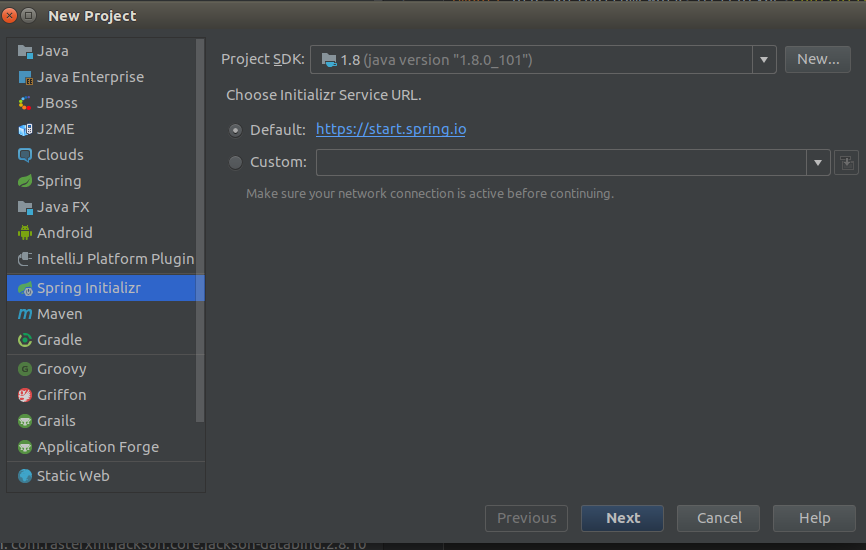
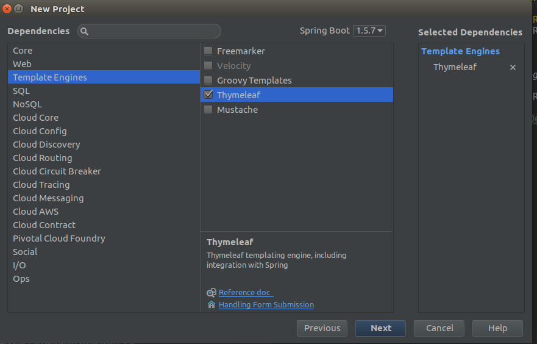
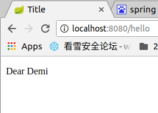

### 1. 引入依赖
maven(pom.xml)中直接引入
```
<dependency>
      <groupId>org.springframework.boot</groupId>
      <artifactId>spring-boot-starter-thymeleaf</artifactId>
    </dependency>
```

可以查看依赖关系,发现spring-boot-starter-thymeleaf下面已经包括了spring-boot-starter-web,所以可以把spring-boot-starter-web的依赖去掉.

如果使用IDEA,则可以自动生成



### 2. 配置视图解析器
spring-boot很多配置都有默认配置,比如：
* 默认页面映射路径为 
```
classpath:/templates/*.html 
```
* 同样静态文件路径为 
```
classpath:/static/
```

在** application.properties **中可以配置thymeleaf模板解析器属性
```
#thymeleaf start
spring.thymeleaf.mode=HTML5
spring.thymeleaf.encoding=UTF-8
spring.thymeleaf.content-type=text/html
#开发时关闭缓存,不然没法看到实时页面
spring.thymeleaf.cache=false
#thymeleaf end
```
具体可以配置的参数可以查看 
***org.springframework.boot.autoconfigure.thymeleaf.ThymeleafProperties***
这个类,上面的配置实际上就是注入到该类中的属性值.

### 3. 编写DEMO
#### 1.控制器
编写一个HelloController.java
```
@Controller
public class HelloController {

    @RequestMapping(value = "/hello", method = RequestMethod.GET)
    public String hello(Model model) {
        model.addAttribute("name", "Dear Demi");
        return "index";
    }
}
```
#### 2.View
在classpath:/templates/下创建一个index.html
(注释为IDEA生成的索引,便于IDEA补全)
```
<!DOCTYPE html>
<html lang="en" xmlns:th="http://www.thymeleaf.org">
<head>
    <!--<meta charset="UTF-8">-->
    <meta content="text/html;charset=UTF-8"/>
    <title>Title</title>
</head>
<body>
<!--/*@thymesVar id="name" type="java.lang.String"*/-->
<p th:text="'Hello !!'+ ${name}+'  :)'">33333</p>
</body>
</html>
```
注意：<meta charset="UTF-8"> 这个写法会报解析错误
$表达式只能写在th标签内部,不然不会生效,
上面例子就是使用th:text标签的值替换p标签里面的值,
至于p里面的原有的值只是为了给前端开发时做展示用的.
这样的话很好的做到了前后端分离.
#### 3. 效果
 
