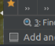

### 下载项目
忘记啦，以后补上，参考视频，基本是用idea直接重github下载的

打开后会自动下载依赖，视频里面只用几分钟，我的下载了接近一个小时，和本地有没有那些依赖库有关吧
### IDEA窗口调出
* 1 . idea刚进去是没有任何工具窗口的，必要的工具窗口可以通过以下的方法调出：
idea顶部的工具栏 --> View --> Tool Windows 

* 2 . 也可以通过万能搜索打开
按 Ctrl+ Shift + a
在弹出的窗口中输入要找的东西就可以啦

* 3 . 默认是没有下面的右边框栏的

点击左下角的小图标会出来

### install项目

要等几分钟

### 各个模块的启动步骤
参考官方的readme.cm就好啦
