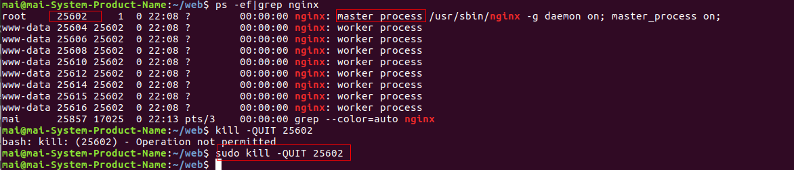

###启动
 启动代码格式：nginx安装目录地址 -c nginx配置文件地址

例如：
```
[root@LinuxServer sbin]#/etc/nginx/nginx -c /etc/nginx/nginx.conf
```

###停止
 nginx的停止有三种方式：

####从容停止
　　1、查看进程号
```
[root@LinuxServer ~]# ps -ef|grep nginx
```

　　2、杀死进程
```
[root@LinuxServer ~]# sudo kill -QUIT 25602
　　
```


####快速停止
1、查看进程号
```
[root@LinuxServer ~]# ps -ef|grep nginx
```
2、杀死进程
```
[root@LinuxServer ~]# kill -TERM 2132
或 [root@LinuxServer ~]# kill -INT 2132
```
####强制停止
 ```
[root@LinuxServer ~]# pkill -9 nginx
```