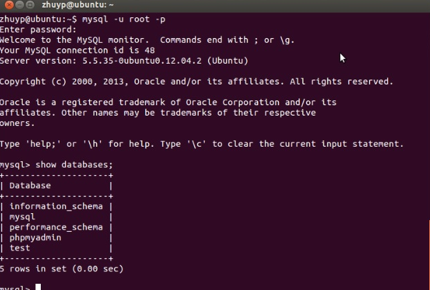
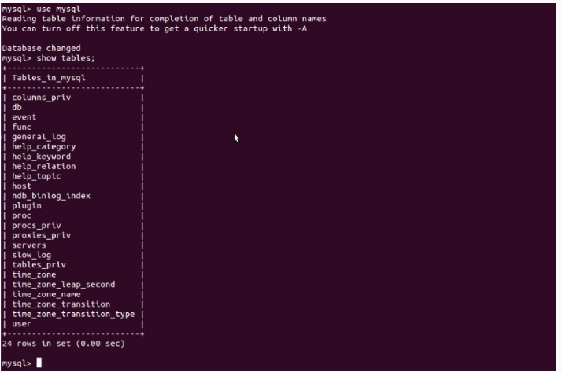
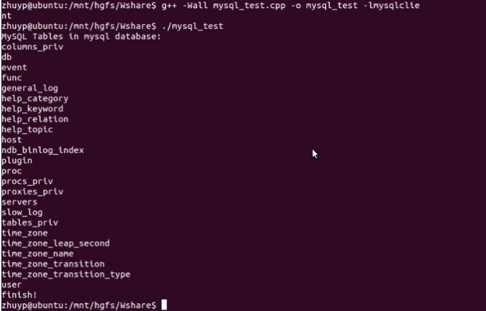

登陆mysql数据库可以通过如下命令：
```
mysql -u root -p
```
-u 表示选择登陆的用户名， -p 表示登陆的用户密码，上面命令输入之后会提示输入密码，此时输入密码就可以登录到mysql。
然后通过 
```
show databases; 
```
就可以查看当前的数据库。


我们选择 mysql数据库就行下一步操作，使用
```
use mysql 
```
命令，显示当前数据库的表单：
```
show tables;
```



###创建数据库
```
mysql> create database zheng;
```


写一个简单的程序来访问该数据库，实现 show tables 功能：
```
#include <mysql/mysql.h>
#include <stdio.h>
#include <stdlib.h>
int main() 
{
    MYSQL *conn;
    MYSQL_RES *res;
    MYSQL_ROW row;
    char server[] = "localhost";
    char user[] = "root";
    char password[] = "mima";
    char database[] = "mysql";
    
    conn = mysql_init(NULL);
    
    if (!mysql_real_connect(conn, server,user, password, database, 0, NULL, 0)) 
    {
        fprintf(stderr, "%s\n", mysql_error(conn));
        exit(1);
    }
    
    if (mysql_query(conn, "show tables")) 
    {
        fprintf(stderr, "%s\n", mysql_error(conn));
        exit(1);
    }
    
    res = mysql_use_result(conn);
    
    printf("MySQL Tables in mysql database:\n");
    
    while ((row = mysql_fetch_row(res)) != NULL)
    {
        printf("%s \n", row[0]);
    }
    
    mysql_free_result(res);
    mysql_close(conn);
    
    printf("finish! \n");
    return 0;
}
```
编译代码的时候需要链接mysql的库，可以通过如下方式编译：
```
g++ -Wall mysql_test.cpp -o mysql_test -lmsqlclient
```
然后运行编译好的代码：

可见结果和使用SQL语句 show tables 是一样的。
