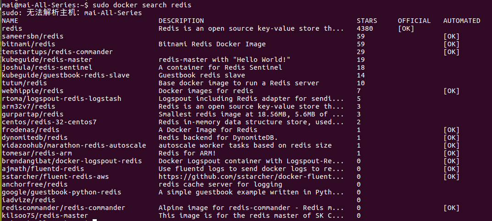

### 1. 查找Docker Hub上的redis镜像
```
docker search  redis
```
 


### 2. 拉取官方的镜像
```
docker pull  redis
```

### 3. 配置redis.conf
这个不是必须的，但redis默认是没有密码的，如果要配置密码需要提供一个redis.conf

创建一个 redis/data 目录，如果需要指定配置文件，那么请在redis目录下放一个redis.conf配置文件。配置文件去redis安装包中找一个


### 4. 启动redis容器
端口映射，data目录映射，配置文件映射。 $PWD指当前目录路径
```
docker run -p 6379:6379 --name myredis -v $PWD/redis.conf:/etc/redis/redis.conf -v $PWD/data:/data -d redis:3.2 redis-server /etc/redis/redis.conf --appendonly yes
```
####4.1命令说明：
* \--name myredis : 指定容器名称，这个最好加上，不然在看docker进程的时候会很尴尬。
* -p 6699:6379 ： 端口映射，默认redis启动的是6379，至于外部端口，随便玩吧，不冲突就行。
* -v $PWD/redis.conf:/etc/redis/redis.conf ： 将主机中当前目录下的redis.conf配置文件映射。
* -v $PWD/data:/data -d redis:3.2 ： 将主机中当前目录下的data挂载到容器的/data
* --redis-server --appendonly yes :在容器执行redis-server启动命令，并打开redis持久化配置\
####4.2注意事项：
如果不需要指定配置，-v $PWD/redis.conf:/etc/redis/redis.conf 可以不用 ，
redis-server 后面的那段 /etc/redis/redis.conf 也可以不用。
主要是用来给redis设置密码的，怕别人偷偷用redis。

###5. 用 redis-cli  检查是否启动成功
###方法一
#### 5.1.1 直接连接到redis容器中：
先查询到myredis容器的ip地址。
```
docker inspect myredis | grep IP 
```
#### 5.1.2 连接到redis容器
192.168.42.32 是4.1里面查询到的ip地址
```
docker run -it redis:3.2 redis-cli -h 192.168.42.32
```
然后就进入redis命令行了。
###方法二
#### 5.2 可以直接通过本机的ip端口连接到redis
如果已经有redis-cli的客户端，非docker方式的
进入之前安装的redis目录，然后执行下面的命令:
```
./bin/redis-cli -p 6379
```


