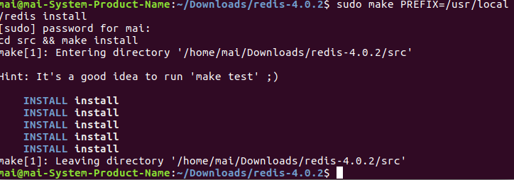

###1 在redis解压的更目录下执行：
```
make
```

###2 完成后执行：
```
make PREFIX=/usr/local/redis install
```
 

/usr/local/redis是用户定义的安装目录

###3 copy解压目录的redis.conf到安装目录下
```
~/Downloads/redis-4.0.2$ sudo cp redis.conf /usr/local/redis/
```

[Redis 安装 启动 连接 配置 重启](http://www.cnblogs.com/GoQC/p/5764201.html) 
