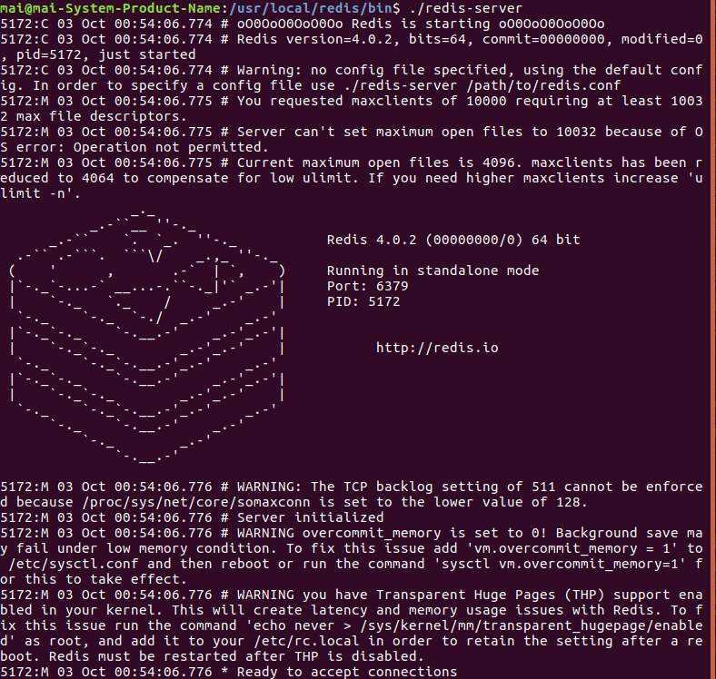
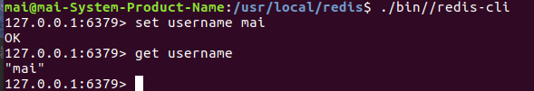

####进入redis安装目录的bin目录下
 
#开启redis的前端启动模式


###打开redis客户端 存储一个数据
新开一个控制台窗口


####注意：启动redis, 客户端连接6370端口
```
redis-cli -h ip地址 -p 端口
```

运行客户端(默认连接本机6379端口)：
```
./bin/redis-clis
``` 
等价于：
```
./bin/redis-cli -p 6379
```
等价于
```
./bin/redis/cli -p 127.0.0.1 -p 6379
```

就是说如果是远程登录，需要更改ip地址

###注意：前端启动模式的弊端是不能部署集群，一般不用
#redis的后端启动模式