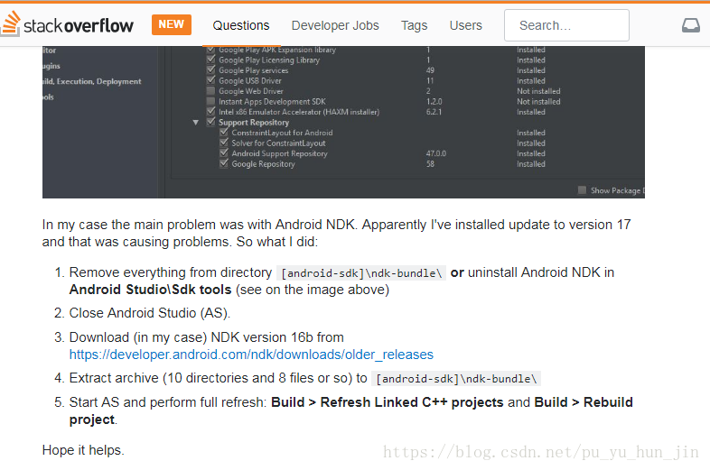
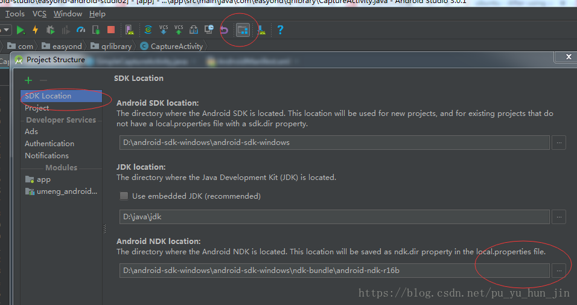

# NDK版本导致的问题
目前没有发现很好的解决方法，尽量把NDK的版本改回r16
解决办法 https://stackoverflow.com/questions/50253566/after-using-android-studio-3-1-2-it-showing-error-2-no-such-file-or-directory

解决方案是: 
1.把刚才下载的NDK17版本的都remove掉,通过Studio下载的就通过Studio删除,自己下载的,去android-sdk-windows\ndk-bundle目录下删除 
2.下载NDK 16b,解压到 android-sdk-windows\ndk-bundle 目录下 ( 这个随意放哪都行,只要在Studio中配置正确就行) 
3.再次build项目 
4.滴 滴 滴 又可以愉快地敲代码了 ! 
原文：https://blog.csdn.net/pu_yu_hun_jin/article/details/80605929 

这里我顺便给下NDK Version 16 的下载链接 
https://dl.google.com/android/repository/android-ndk-r16b-windows-x86.zip 
https://dl.google.com/android/repository/android-ndk-r16b-windows-x86_64.zip 
https://dl.google.com/android/repository/android-ndk-r16b-darwin-x86_64.zip 
https://dl.google.com/android/repository/android-ndk-r16b-linux-x86_64.zip

NDK Version 17 (目前最新版) 
https://dl.google.com/android/repository/android-ndk-r17-windows-x86.zip 
https://dl.google.com/android/repository/android-ndk-r17-windows-x86_64.zip 
https://dl.google.com/android/repository/android-ndk-r17-darwin-x86_64.zip 
https://dl.google.com/android/repository/android-ndk-r17-linux-x86_64.zip
