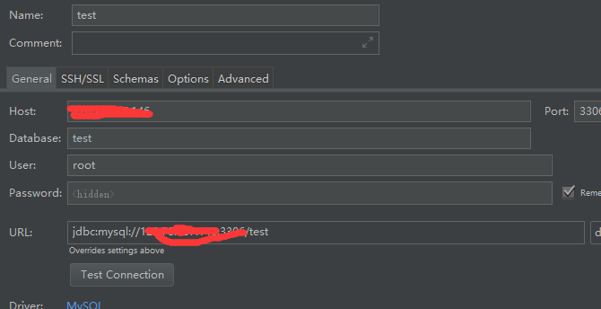
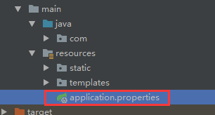

## Step 1: 数据库源配置
需要手动在mysql中创建一个数据库，其中的表，spring会根据实体类自动生成
### 1.1 引入依赖
在pom.xml
```
      <dependency>
          <groupId>org.springframework.boot</groupId>
          <artifactId>spring-boot-starter-data-jpa</artifactId>
      </dependency>
      <dependency>
          <groupId>mysql</groupId>
          <artifactId>mysql-connector-java</artifactId>
      </dependency>
```

### 1.2 配置需要连接的数据库
注意，这里要和1.3的数据库配置一致，否则会导致找不到数据库



### 1.3 在application.properties中配置
如下图，


配置如下
```
spring.datasource.url=jdbc:mysql://120.XX.XXX.1XX:3306/test
spring.datasource.username=root
spring.datasource.password=XXXXXX
spring.datasource.driver-class-name=com.mysql.jdbc.Driver
```

## Step 2: 编写实体类
```
@Entity // 实体类注解
public class User {
    @Id  // 标识为id
    @GeneratedValue // 自增
    private long id;
    @Column(nullable = false, unique = true)
    private String userName;
    @Column(nullable = false)
    private String password;
    @Column(nullable = false)
    private int age;

    // get and set
}
```

## Step 3: 编写Repository和Service 接口
继承JpaRepository
```
public interface UserRepository extends JpaRepository<User, Long> {

    User findById(long id);

    Long deleteById(Long id);
}
```

编写一个操作数据库的Service接口
```
public interface UserService {

    public List<User> getUserList();

    public User findUserById(long id);

    public void save(User user);

    public void edit(User user);

    public void delete(long id);
}
```

## Step 4:绑定Repository接口和实现Service接口
```
@Service
public class UserServiceImpl implements UserService{

    @Autowired // 绑定Step3的Repository接口
    private UserRepository userRepository;

    @Override
    public List<User> getUserList() {
        return userRepository.findAll();
    }

    @Override
    public User findUserById(long id) {
        return userRepository.findById(id);
    }

    @Override
    public void save(User user) {
        userRepository.save(user);
    }

    @Override
    public void edit(User user) {
        userRepository.save(user);
    }

    @Override
    public void delete(long id) {
        userRepository.delete(id);
    }
}
```

通过调用UserServiceImpl就可以对数据库指定表做增删查改
