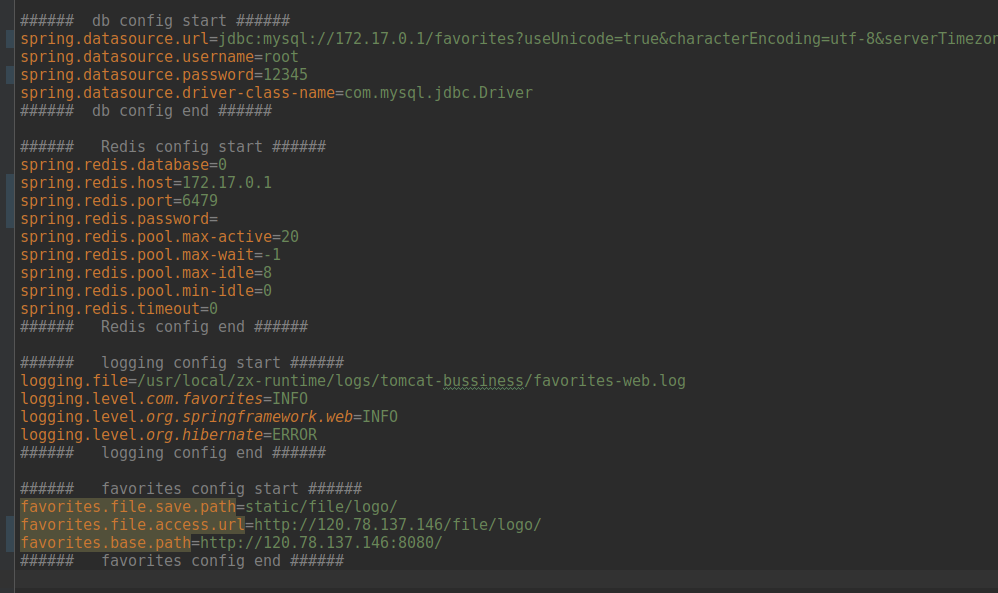

#下面是基于docker部署的一些坑
## 1 修改项目里面的properties
为了方便调试新一个 application-test.properties
在application.properties里面设置使用
```
spring.profiles.active=test
```

application-test.properties的配置

###修改的地方分别有
#### 1.1 把mysql和redis配置中的127.0.0.1改回172.17.0.1
因为我用docker配置，不改会连接不上，这个改成ifconfig里面看到的docker的ip地址，这里有些迷惑，以后有机会理解再补全

#### 1.2 mysql和redis 的密码修改
mysql修改成自己配置的，redis默认是没有密码的，留空就行，可以通过redis.cnf配置密码

注意: 要在mysql新建一张叫favorites的表，不需要导入表数据就可以了
因为我把reids的端口从6379映射为6479了，所以这里redis的post=6479

#### 1.3 base path的修改
把原来的120.0.0.1改成后台服务器的ip,
base path 里面的端口要对应docker容器运行时映射的端口


## 2 服务器部署

#### 2.1 mysql和redis的配置 （docker镜像版）
下载镜像
```
docker pull mysql
```
```
docker pull redis
```

运行镜像
```
docker run -v $PWD/data:/mysql_dat -d -p 3306:3306 --name 你给容器起的名字 mysql
```
```
docker run -d -p 6479:6379 --name 你给容器起的名字 redis 
```
注意：这里是最简单的例子，更多配置请看**云收藏项目只要配置mySQL和redis就能跑起来_配置说明.md**

#### 2.2 云收藏项目在docker上运行
#### 2.2.1 创建云收藏项目的docker镜像
2.2.1.1. 本地生成jar包
```
## 在项目的根目录(和pom.xml同级)下执行
mvn clean package
## 或者
## 排除测试 后进行打包
mvn clean package -Dmaven.test.skip=true
```
2.2.1.2. 把jar上传到服务器
2.2.1.3. 在jar包同级目录下创建一个Dockerfile,内容如下：
```
# 在java:8镜像的基础上新建一个镜像
FROM java:8 

# 作者
MAINTAINER mai

#  favorites-web-0.1.0-SNAPSHOT.jar 是云项目生产的jar
ADD favorites-web-0.1.0-SNAPSHOT.jar app.jar

# 暴露8080端口，注意只有暴露的端口可以外面访问
EXPOSE 8080

ENTRYPOINT ["java","-jar","/app.jar"]

```
2.2.1.4. 生成镜像
```
docker build -t 生成镜像的名字 .
```
后面那个点代表当前目录

2.2.1.5. 查看生成镜像
```
docker images
```
#### 2.2.2 运行2.2.1创建镜像的容器

```
docker run -d -p 80:8080 --name 容器名字 上一步创建的镜像
```


