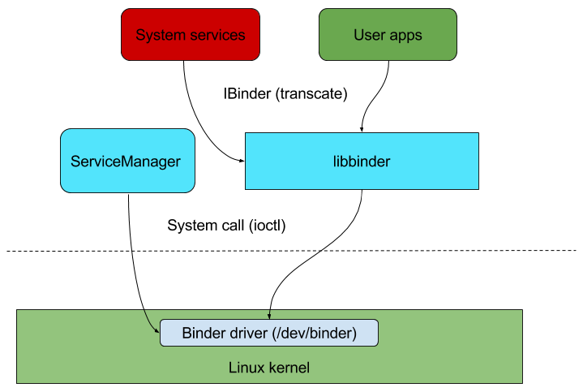
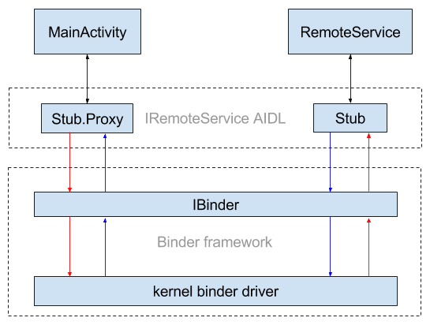
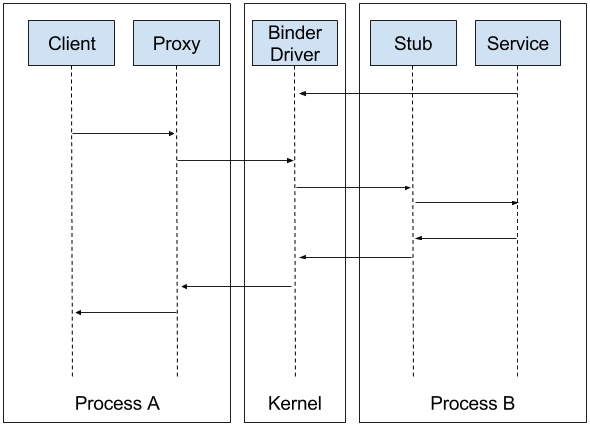
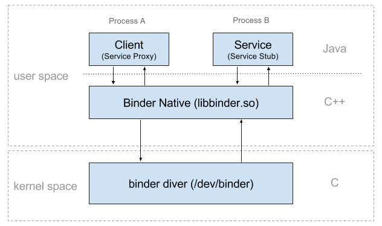

#Binder 源码解析笔记
##1.Binder简介： 
 * Android进程间通讯的机制，提供远程过程调用功能(Remote Procedure Call)

 * 最直接的使用是：Context.getSystemService()来获取系统服务；AIDL实现多个程序间数据(APP)交互

 * Intent, Messager等都是对Binder更高的封装和抽象

 * 调用流程图：

##2.Binder与AIDL
  ### AIDL简介
  AIDL(Android Interface Definition Language)是接口描述语言，用于生成在两个进程间通讯的代码。
  概念图：
  
  * Stub.Proxy和Stub代码是Android SDK自动生成的java文件的内部类，客户端通过Stub.Proxy与远程服务交互
  * Stub包含对IBinder对象操作的封装，需要远程服务实现具体功能

  ### 2.1 AIDL 客户端
  * 使用步骤：
    1. 在AS上 New -> AIDL -> AIDL File -> 输入文件名
    2. 编译运行后会自动生成java文件
    注意：
    * 默认只支持基本类型，自定义的Object类型需要实现Parcelable接口
    * 自动生成的java文件中有有两个内部类Stub和Stub.Proxy
    * 客户端从Stub.asInterface得到远程服务的实例(自定义服务名(Stub.Proxy)),这个实例是通过Binder传递来的 远程对象 的包装。
    * 文件名和内容需要和服务端一致

  ### 2.2 AIDL 服务端
 * 使用步骤：
   1. aidl文件和相关生成文件和客户端一致
   2. 在服务端自动生生成的java文件中实现basicTypes和自定义的方法(给客户端调用)
    
 ### 2.3 远程服务的获取和使用
 1. 客户端使用远程服务，需要绑定服务(bindService)并建立服务连接(ServiceConnection)
 2. 在连接服务中onServiceConnected()回调中得到IBinder的实例
 3. 通过 (自定义服务名).Stub.asInterface(IBinder实例)获取远程服务的实例
 4. 通过远程服务的实例调用远程方法
 扩展：
 1.客户端调用远程方法实际上是通过IBinder实例的transact()方法，发送了与服务端约定好的命令Stub.TRANSACTION_...，并将参数按格式打包进Parcel对象
 2.服务端则在onTransact()受到命令后对命令和参数重新解析，并调用指定的自定义远程方法

##3. Binder框架及Native层
   ###简介：
   * Binder使用Service/Client架构，客户端通过服务端代理，经过Binder驱动和服务端交互

   * Binder机制通信主要通过kernel中的Binder驱动

图表补充：
	* JNI代码位于 frameworks/base/core/jni 目录下，主要是 android_util_Binder.cpp文件和头文件 android_util_Binder.h
	* JNI 代码是Java层到Native层的接口封装，会编译进 libandroid_runtime.so 系统库
	* Binder 本地层代码在 frameworks/native/libs/binder 目录下，此目录编译后生成libbinder.so文件，供JNI调用。
	* libbinder 封装了所有对binder驱动的操作，是上层应用与驱动交互的桥梁，头文件则在frameworks/native/include/binder 目录下。