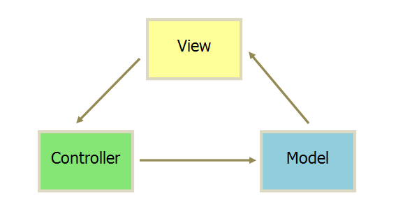
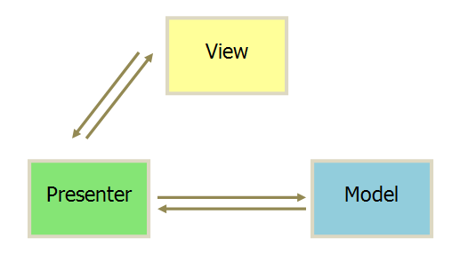
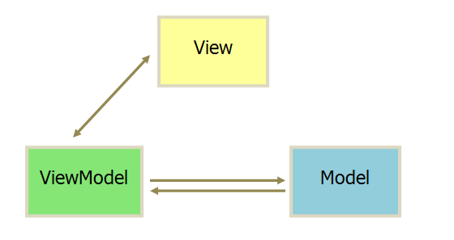

一、MVC（Model-View-Controller）

MVC是比较直观的架构模式，用户操作->View（负责接收用户的输入操作）->Controller（业务逻辑处理）->Model（数据持久化）->View（将结果反馈给View）。

MVC使用非常广泛，比如JavaEE中的SSH框架（Struts/Spring/Hibernate），Struts（View, STL）-Spring（Controller, Ioc、Spring MVC）-Hibernate（Model, ORM）以及ASP.NET中的ASP.NET MVC框架，xxx.cshtml-xxxcontroller-xxxmodel。（实际上后端开发过程中是v-c-m-c-v，v和m并没有关系，下图仅代表经典的mvc模型）

二、MVP（Model-View-Presenter）

MVP是把MVC中的Controller换成了Presenter（呈现），目的就是为了完全切断View跟Model之间的联系，由Presenter充当桥梁，做到View-Model之间通信的完全隔离。

.NET程序员熟知的ASP.NET webform、winform基于事件驱动的开发技术就是使用的MVP模式。控件组成的页面充当View，实体数据库操作充当Model，而View和Model之间的控件数据绑定操作则属于Presenter。控件事件的处理可以通过自定义的IView接口实现，而View和IView都将对Presenter负责。

[google官方MVP例子](https://github.com/googlesamples/android-architecture/tree/todo-mvp) 

三、MVVM（Model-View-ViewModel）

如果说MVP是对MVC的进一步改进，那么MVVM则是思想的完全变革。它是将“数据模型数据双向绑定”的思想作为核心，因此在View和Model之间没有联系，通过ViewModel进行交互，而且Model和ViewModel之间的交互是双向的，因此视图的数据的变化会同时修改数据源，而数据源数据的变化也会立即反应到View上。

这方面典型的应用有.NET的WPF，js框架Knockout、AngularJS等。

[google官方的mvvm例子](https://github.com/googlesamples/android-architecture/tree/todo-mvvm-databinding) 