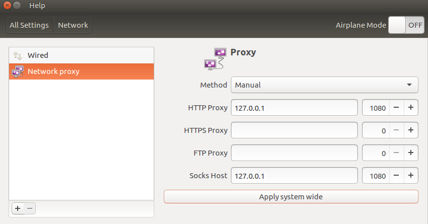
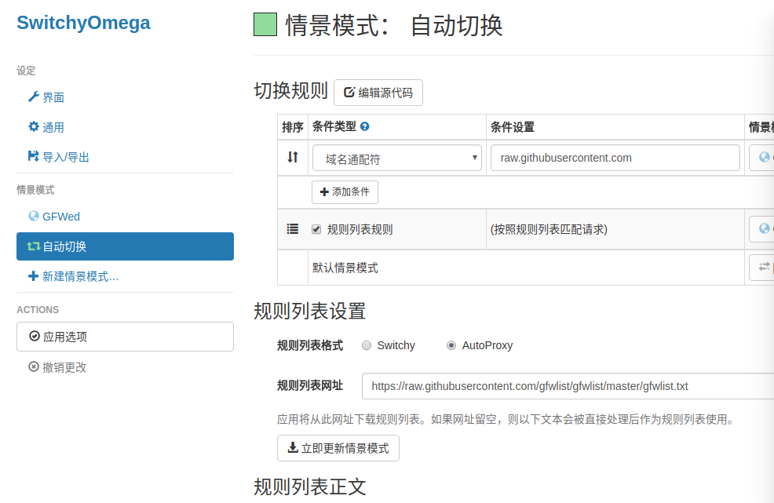

### Service 端
Service端装的是Python版本，控制命令如下：

启动脚本后面的参数含义，从左至右依次为：启动，停止，重启，查看状态。
```
Shadowsocks-Python 版：
/etc/init.d/shadowsocks-python start | stop | restart | status
```


### Client 端
* 配置文件 /etc/shadowsocks.json. Example:
```
{
    "server":"45.77.102.215",
    "server_port":8989,
    "local_address": "127.0.0.1",
    "local_port":1080,
    "password":"mypassword",
    "timeout":300,
    "method":"aes-256-gcm,
    "fast_open": false
}
```
* 启动脚步：
```
sudo sslocal -c /etc/shadowsocks.json -d start
```
* 停止脚步：
```
sudo sslocal -c /etc/shadowsocks.json -d stop
```
* ip配置


* 自动切换
chrome插件:SwitchyOmega

直接导入备份的配置文件OmegaOptions.bak即可